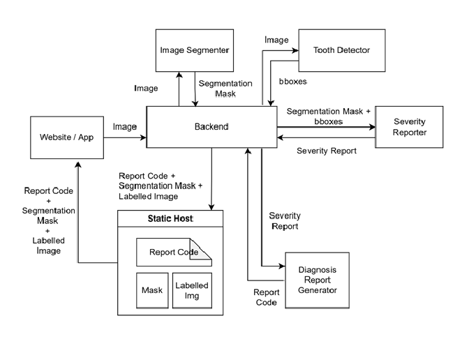
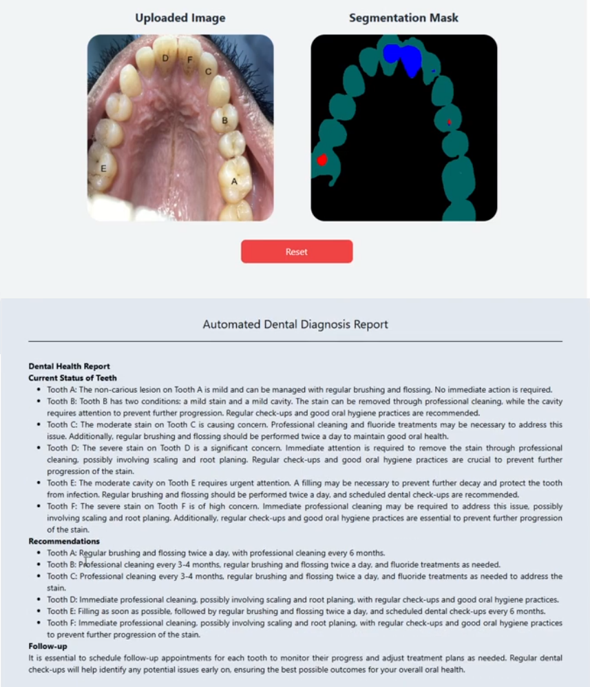

# Automated Dental Diagnosis

An AI-based application that uses computer vision and LLM agents to diagnose & report dental diseases. 

## Current Features
The current version of the application can diagnose the following dental conditions:
- **Cavity & micro-cavity**
- **Non-carious lesion**
- **Calculus**
- **Dental Stain**

---

## Data Processing & Model Training
For details about the data processing and model training repository, visit: 
[Intra-Oral Image Segmentation](https://github.com/confusedOrca/Intra-Oral-Image-Segmentation)

---

## Application Design
The design of the application is as follows:

The diagnosis report generator comprises two AI agents:
- **Dentist** --> uses severity data to report diseases and suggest actionable steps. LLM used: Llama3.2:3B
- **HTML Coder** --> formats Dentist's report to HTML to make it presentable on the web. LLM used: Qwen2.5-coder:3B

---

## Examples of Diagnoses

### Images with No Tooth

### Images with No Disease

### Images with Diseases

